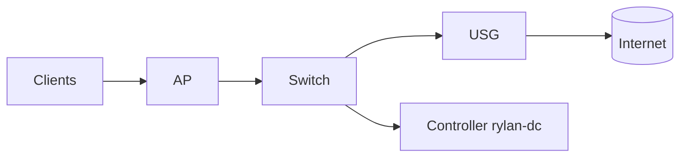

# AI Copilot Prompt Templates

## Network Configuration
- Generate UniFi VLAN JSON for [VLAN_NAME] with subnet [SUBNET] and DHCP range [RANGE]
- Create firewall rule to block IoT VLAN from accessing [TARGET]
- Generate backup script that retains last [N] days and compresses with gzip

## Troubleshooting
- Analyze this UniFi adoption error log: [PASTE_LOG]
- Debug MongoDB connection failure on Ubuntu 24.04
- Interpret UniFi controller `server.log` entries for high CPU usage

## Documentation
- Create step-by-step guide for migrating UniFi controller to new hardware
- Generate network diagram in Mermaid format for [TOPOLOGY_DESCRIPTION]
- Summarize differences between UniFi versions [OLD] and [NEW]

## Example Mermaid Template

## Usage Guidance
| Area | Prompt Strategy |
|------|-----------------|
| VLAN | Provide ID, subnet, purpose |
| Firewall | List source, destination, action, protocol |
| Backup | Specify retention, compression, encryption needs |
| Restore | Include version metadata and target environment |

## Security Notes
- Avoid pasting secrets or private keys into prompts.
- Sanitize logs before sharing (remove public IPs if sensitive).

---
End of AI copilot command templates.
